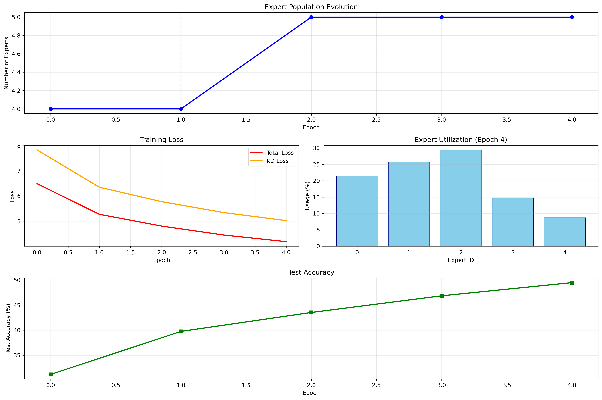
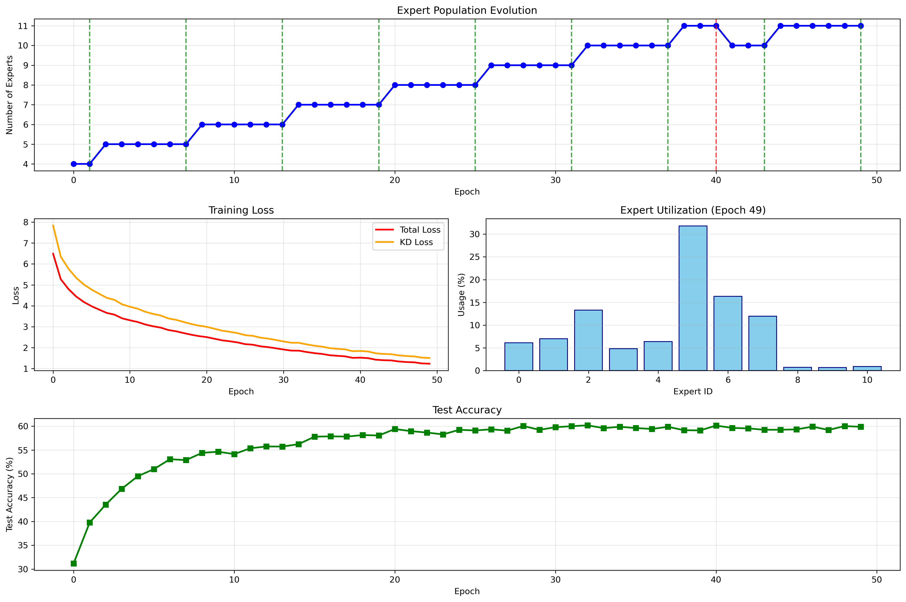
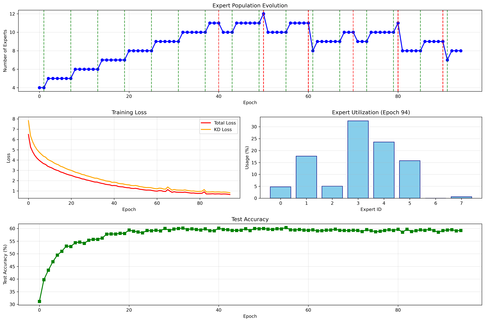

# Adaptive Mixture of Experts for Image Classification

This research project is an experimental implementation of an Adaptive Mixture of Experts (MoE) model for image classification. The goal was to explore whether a model could learn to dynamically adjust its own architecture during training by adding or removing "expert" subnetworks in response to the learning task.

## Approach

The experiment uses a knowledge distillation framework with a student-teacher setup:

*   **Teacher Model:** A pre-trained ResNet-50 model, fine-tuned on the CIFAR-100 dataset, serves as the source of "expert" knowledge.
*   **Student Model:** A smaller ResNet-18 model is modified with a custom Mixture of Experts (MoE) layer. This student model is trained to mimic the teacher's predictions.

The core of the experiment is the **adaptive mechanism**:

*   **Expert Birth:** New experts are added to the MoE layer when the model's knowledge distillation loss indicates that it is struggling to learn from the teacher. This suggests that more specialized capacity is needed.
*   **Expert Death:** Experts are removed (pruned) if they are found to be redundant, underutilized, or detrimental to the model's performance. Redundancy is measured by the similarity of their outputs to other experts.

The entire process is visualized in real-time during training, tracking the number of experts, loss, accuracy, and expert utilization.

## Current Status & Results

The model was trained on the CIFAR-100 dataset. While the adaptive mechanism for adding and removing experts was successful from a functional standpoint, the final classification accuracy achieved was not significant.

*   **Final Accuracy:** ~58.69%

The visualizations generated during the training (`viz_*.png` files) illustrate the dynamic nature of the expert population and the learning process.

## Files

*   `random_weight_init.ipynb`: The Jupyter Notebook containing the complete code for the experiment, including the model definitions, training loop, and visualization logic.
*   `viz_*.png`: Image files showing the state of the training at various epochs and when expert birth/death events occurred.

## Visualizations

Here are a few sample visualizations from the training process:

**Epoch 5**

**Epoch 50**

**Epoch 95**

## Conclusion

This project serves as a proof-of-concept for the adaptive MoE architecture. The results suggest that while the mechanism for dynamically altering the model is viable, further research is needed to improve the decision-making process for adding/removing experts to achieve competitive performance. The current implementation did not lead to a breakthrough in classification accuracy.
